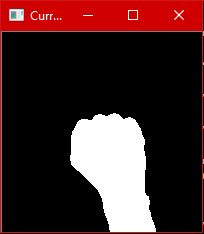
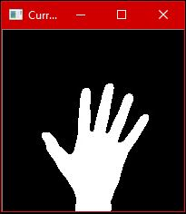
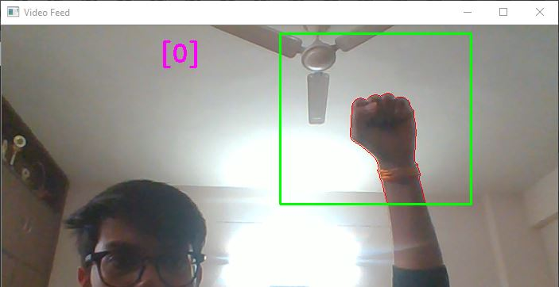
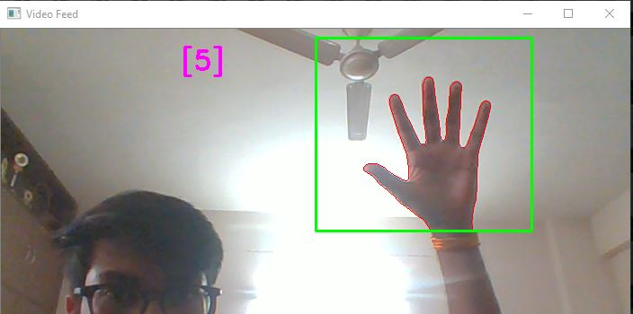

# Hand Gesture Recognition

Goal is to recognize hand gestures. I've trained the model on my own dataset using *Perceptron*. I've included my the dataset in the repository itself. In it's present state the model is trained to recognize just two gestures but can easily be trained for many hand gestures.
I'll also upload the code that I'm using for capturing the hand an processing it for training the model.

Model gives a high testing accuracy of about **99%** using just two *Dense* layers. But if you want to train more hand gestures then you'll probably need more a complex network.

Images in the dataset are of dimension *200 by 200*. But for performance reasons they have been resized to *50 by 50*. You can use them as it is if you have a powerful setup otherwise program displays a Tensorflow error 
`tensorflow/core/framework/allocator.cc:101] Allocation of X exceeds 10% of system memory.`

## What's in the Repository

* `captureHand.py` - This program can capture new hand gestures and write them in the specified directory
* `recognizer.py` - This is the main program that uses pretrained model (in the repo) for recognizing hand gestures
* `trainer.py` - This program uses the given dataset to train the Perceptron model
* `modelWeights.h5` - Weights for the Perceptron model
* `trainedModel.json` - JSON format of the model

## Sample of images in the Dataset

* First Hand Gesture

* Second Hand Gesture

## Required External libraries

* `cv2 (opencv)`
* `imutils`
* `glob`
* `sklearn (scikit-learn)`
* `keras`
* `numpy`

## What You Should See

* For the first gesture

* For the first gesture

## Future

I hope to implement more than two gestures in the future. There will be further improvements in the code itself too.
